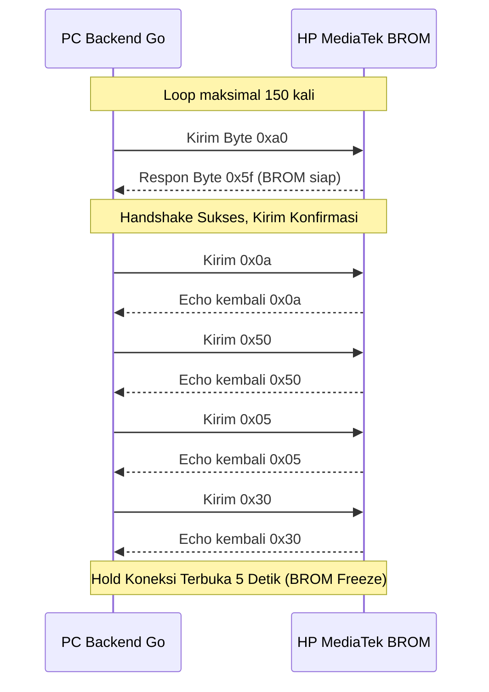

# Dokumentasi & Analisis Backend Go CLI (Android Multi Tools)

Dokumen ini merinci arsitektur, modul-modul kode, alur logika, serta analisis teknis dari mesin backend Golang (**Go CLI Engine**) yang menangani deteksi perangkat keras, protokol serial port MTK BROM, ekstraksi firmware, dan antarmuka HTTP/SSE untuk Web GUI.

---

## 📂 1. Arsitektur File Go Backend

Struktur backend terbagi menjadi beberapa paket fungsional:
1. **[main.go](file:///home/billy/SEKOLAH/Android_Tools/main.go)**: Titik masuk (*entrypoint*) program yang mengalihkan penanganan argumen CLI ke paket `routes`.
2. **Paket `routes/`**:
   - **[router.go](file:///home/billy/SEKOLAH/Android_Tools/routes/router.go)**: Mengurai input CLI (`fastboot`, `mtk`, `extract`, `ui`) dan mengontrol alur eksekusi loop pemantauan terminal.
   - **[server.go](file:///home/billy/SEKOLAH/Android_Tools/routes/server.go)**: Engine web server lokal menggunakan `net/http` yang menyediakan REST API, dialog browser native (zenity/powershell), dan streaming log real-time melalui Server-Sent Events (SSE).
3. **Paket `detector/`**:
   - **[detector.go](file:///home/billy/SEKOLAH/Android_Tools/detector/detector.go)**: Mendeklarasikan struct penampung data `DeviceInfo`.
   - **[detector_linux.go](file:///home/billy/SEKOLAH/Android_Tools/detector/detector_linux.go)**: Logika pemindaian USB di Linux dengan membaca informasi sysfs filesystem secara langsung (`/sys/bus/usb/devices`).
   - **[detector_windows.go](file:///home/billy/SEKOLAH/Android_Tools/detector/detector_windows.go)**: Logika pemindaian USB di Windows dengan mengeksekusi perintah PowerShell `Get-PnpDevice` dan memproses output JSON-nya.
   - **[handshake.go](file:///home/billy/SEKOLAH/Android_Tools/detector/handshake.go)**: Implementasi protokol jabat tangan MediaTek BROM tingkat rendah (low-level serial connection) menggunakan `go.bug.st/serial`.
4. **Paket `extractor/`**:
   - **[extractor.go](file:///home/billy/SEKOLAH/Android_Tools/extractor/extractor.go)**: Logika untuk mengekstrak arsip firmware Xiaomi berformat `.tar` atau `.tgz` secara asinkron dengan fitur keamanan pencegahan celah *path traversal* (Zip Slip).

---

## ⚙️ 2. Analisis Rinci Setiap Modul

### A. Modul Deteksi USB Lintas Platform (`detector/`)

Deteksi dirancang agar berjalan tanpa dependensi library C/C++ (CGO) untuk kemudahan kompilasi silang (*cross-compile*).

#### 1. Implementasi Linux (`detector_linux.go`)
Di Linux, modul memindai direktori `/sys/bus/usb/devices/`:
* **Fastboot Interface:** Dicari dengan membaca file deskriptor USB:
  - `bInterfaceClass` bernilai `ff` (Vendor Specific)
  - `bInterfaceSubClass` bernilai `42`
  - `bInterfaceProtocol` bernilai `03`
* **MediaTek BROM / Preloader:** Menggunakan Vendor ID (VID) `0e8d` dengan Product ID (PID) `0003` (BROM) atau `2000` (Preloader).
* **Pemetaan Port Serial Virtual:** Melakukan globbing path untuk menemukan node `/dev/ttyACMx` yang terasosiasi dengan USB tersebut:
  ```go
  filepath.Glob(filepath.Join(devicePath, "*", "tty", "tty*"))
  ```

#### 2. Implementasi Windows (`detector_windows.go`)
Di Windows, modul memanggil PowerShell untuk melakukan query WMI / PnP:
* Perintah PowerShell mencari ID Hardware PNP:
  ```powershell
  Get-PnpDevice -PresentOnly | Where-Object { ($_.HardwareID -like "*Class_ff&SubClass_42&Prot_03*") -or ($_.FriendlyName -like "*Android Bootloader*") }
  ```
* Melakukan parsing Instance ID untuk mengambil String VID, PID, dan nomor seri.
* Menggunakan ekspresi reguler `\((COM\d+)\)` untuk mengekstrak nama COM Port virtual secara otomatis dari `FriendlyName` perangkat (misal: `MediaTek USB Port (COM5)`).

---

### B. Protokol Jabat Tangan MTK BROM (`detector/handshake.go`)

Protokol handshake BROM digunakan untuk mengunci chip boot rom agar tidak masuk ke mode boot normal/preloader. 


Proses di atas memanfaatkan port komunikasi serial standard pada BaudRate **115200**. Penahanan koneksi selama 5 detik (`time.Sleep`) sesudah handshake berguna agar sirkuit daya USB tetap stabil, memberikan waktu bagi pengguna untuk melepaskan tombol volume fisik ponsel.

---

### C. Ekstraksi Aman Firmware (`extractor/extractor.go`)

Ekstraksi firmware `.tgz` / `.tar` menggunakan pustaka bawaan `archive/tar` dan `compress/gzip`.

#### Keamanan dari Kerentanan Zip Slip
Kerentanan **Zip Slip** terjadi jika file arsip yang jahat mengandung path relatif seperti `../../etc/passwd` yang dapat menulis berkas di luar folder ekstraksi target. Modul memitigasi hal ini dengan cara membersihkan path tujuan menggunakan `filepath.Clean`:
```go
cleanPath := filepath.Clean(header.Name)
if strings.HasPrefix(cleanPath, "..") || strings.HasPrefix(cleanPath, "/") {
    continue // Abaikan berkas yang melanggar batasan direktori target
}
```

Modul juga melakukan logging yang interaktif, menampilkan progres file utama seperti file partisi system (`.img`, `.bin`) dan script flash (`.sh`, `.bat`) beserta ukuran data dalam megabyte (MB).

---

### D. Routing CLI & Web Server GUI (`routes/`)

#### 1. Routing CLI (`routes/router.go`)
Fungsi `RouteCommand` memproses argument input. Jika perintah berupa `ui`, ia akan memicu peluncuran Web GUI. Jika berupa `fastboot` atau `mtk`, program menjalankan loop pemantauan USB berkala setiap 2 detik menggunakan Go `time.Ticker` dan menangani sinyal terminasi OS (SIGINT/SIGTERM) agar bisa keluar dari loop secara bersih.

#### 2. Engine Web GUI (`routes/server.go`)
Web Server bertindak sebagai jembatan untuk tampilan GUI berbasis web lokal:
* **Server-Sent Events (SSE) `/api/stream`:** Menyediakan saluran satu arah untuk mengalirkan logs pendeteksian USB real-time dari Go langsung ke browser tanpa perlu polling HTTP terus-menerus.
* **Integrasi File Dialog Asli (API `/api/browse`):**
  Mengatasi keterbatasan web browser yang tidak memiliki akses langsung untuk menelusuri folder sistem operasi. Backend mendeteksi OS saat ini, lalu memanggil:
  - Di Windows: Script PowerShell `New-Object System.Windows.Forms.OpenFileDialog` secara tersembunyi.
  - Di Linux: Utilitas dialog desktop native `zenity --file-selection`.
  Setelah berkas dipilih, path lengkapnya dikembalikan sebagai JSON ke browser.
