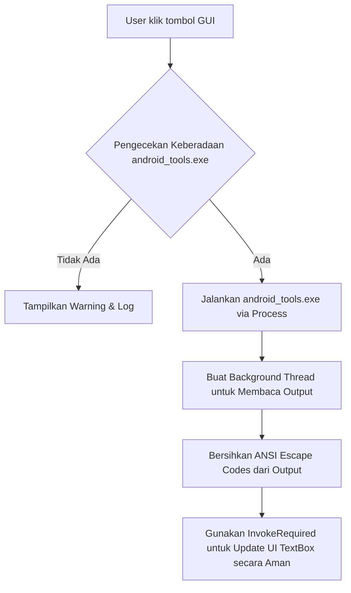

# Dokumentasi & Analisis GUI C# (Android Multi Tools)

Dokumen ini menjelaskan arsitektur, kode program, alur logika, serta analisis teknis dari antarmuka pengguna berbasis desktop native Windows Forms C# (**gui_csharp**) yang digunakan sebagai frontend untuk backend Go CLI (`android_tools.exe`).

---

## 📂 1. Daftar File Kode Sumber

Folder `gui_csharp/` terdiri dari tiga file utama:
1. **[Program.cs](file:///home/billy/SEKOLAH/Android_Tools/gui_csharp/Program.cs)**: Berfungsi sebagai titik masuk (*entry point*) utama untuk aplikasi.
2. **[Form1.cs](file:///home/billy/SEKOLAH/Android_Tools/gui_csharp/Form1.cs)**: Berisi logika di belakang layar (*code-behind*), termasuk manajemen proses, multithreading, penanganan event tombol, dan manipulasi teks log.
3. **[Form1.Designer.cs](file:///home/billy/SEKOLAH/Android_Tools/gui_csharp/Form1.Designer.cs)**: File otomatis buatan desainer Windows Forms yang mendeklarasikan tata letak, komponen (tombol, tab, textbox, panel), dan asosiasi event handler.

---

## ⚙️ 2. Analisis Arsitektur GUI

Aplikasi ini menggunakan pola **GUI Wrapper** (pembungkus antarmuka). Alih-alih mengimplementasikan fungsi tingkat rendah langsung di C#, C# murni digunakan untuk **interaksi visual** dan meluncurkan utilitas CLI Go (`android_tools.exe`) secara asinkron di latar belakang.

### Flow Diagram Eksekusi


---

## 🔍 3. Rincian Logika & Implementasi Kode ([Form1.cs](file:///home/billy/SEKOLAH/Android_Tools/gui_csharp/Form1.cs))

### A. Inisialisasi & Pemeriksaan Dependensi (`Form1_Load`)
Saat aplikasi pertama kali dibuka, form akan memeriksa keberadaan mesin backend Go dan memuat aset branding:
* **Pengecekan File:** Memeriksa `android_tools.exe`. Jika tidak ada, warning akan ditampilkan di dalam kotak log dan kotak pesan pop-up (`MessageBox`).
* **Pemuatan Logo Dinamis:** Mencari file `Logo.jpeg` atau `download (1).png`. Jika ditemukan, gambar logo akan dipasang di `picLogo`.
* **Pemuatan Ikon:** Jika `Logo.ico` ada, maka ikon jendela program (`this.Icon`) akan disesuaikan.

### B. Menjalankan Backend Go CLI (`RunBackend`)
Ketika tombol pemantau (Fastboot atau MTK) diklik, fungsi `RunBackend(string arguments)` dipanggil:
* Menggunakan `ProcessStartInfo` untuk menjalankan berkas biner Go dengan argumen yang sesuai (`fastboot` atau `mtk`).
* Mengatur opsi proses berikut agar berjalan di balik layar tanpa memunculkan jendela konsol baru:
  - `UseShellExecute = false`
  - `CreateNoWindow = true`
  - `RedirectStandardOutput = true`
  - `RedirectStandardError = true`
  - `StandardOutputEncoding = Encoding.UTF8`

### C. Menghindari GUI Beku (Multithreading & Invocation)
Agar aplikasi tidak membeku (*hang*) saat membaca keluaran dari proses Go, C# menggunakan *background thread* terpisah (`readThread`):
1. **Background Reader Thread:**
   Membaca baris demi baris dari stream standard output proses backend secara asinkron.
2. **Thread Safety (`AppendLog`):**
   Kontrol Windows Forms tidak mengizinkan modifikasi langsung dari luar thread UI (UI Thread). Oleh karena itu, digunakan properti `InvokeRequired` dan metode `.Invoke()` untuk menyeberang kembali ke UI thread dengan aman:
   ```csharp
   if (txtLog.InvokeRequired)
   {
       txtLog.Invoke(new Action<string>(AppendLog), text);
   }
   ```
3. **Pembersihan Kode Warna ANSI (`RemoveAnsiEscapeCodes`):**
   Go CLI sering kali mengeluarkan kode warna terminal ANSI (seperti `\x1B[31m`). Jika langsung dimasukkan ke dalam TextBox Windows Forms, kode tersebut akan tampil sebagai karakter aneh. C# menggunakan regex berikut untuk menyaringnya:
   ```csharp
   System.Text.RegularExpressions.Regex.Replace(input, @"\x1B\[[^@-~]*[0-9A-Za-z]", "");
   ```

### D. Kontrol Logika Konflik Pemantauan
Untuk mencegah dua pemantauan USB berjalan secara bersamaan pada port yang sama (yang dapat memicu *port conflict*):
* Saat Fastboot Monitor dimulai, tombol MTK Monitor dinonaktifkan (`btnStartMtk.Enabled = false`).
* Sebaliknya, saat MTK Monitor dimulai, tombol Fastboot Monitor dinonaktifkan (`btnStartFastboot.Enabled = false`).
* Semua tombol akan kembali aktif (*reset*) setelah monitor dihentikan menggunakan `ResetControlStates()`.

### E. Penanganan Ekstraksi Firmware (`btnExtract_Click`)
Fitur ekstraksi firmware (`extract "<path>"`) dijalankan pada thread terpisah (`extractThread`):
* Menampilkan status `"Extracting..."` pada tombol ekstraksi dan menonaktifkannya untuk mencegah klik ganda.
* Membaca output real-time dari Go untuk menampilkan progres di kotak log.
* Setelah selesai (sukses atau gagal), memicu `ResetControlStates()` kembali untuk memulihkan tombol ke kondisi semula.

---

## 📊 4. Kelebihan & Rekomendasi Optimasi

### Kelebihan Desain GUI C# Ini:
1. **Sangat Ringan:** Ukuran file hasil kompilasi sangat kecil (< 50 KB) dan penggunaan memori (RAM) sangat minim karena menggunakan pustaka standard `.NET Windows Forms`.
2. **Real-time Log Streams:** Logging yang dialirkan baris-demi-baris secara dinamis ke textbox, lengkap dengan waktu timestamp lokal.
3. **Pencegahan Kebocoran Memori & Proses Gantung:** Menjamin penghentian proses CLI Go melalui event penutupan form (`Form1_FormClosing`) dan pembersihan memori (`StopBackend`).

### Rekomendasi untuk Pengembangan Selanjutnya:
* **Penanganan Standard Error (`Stderr`):** Saat ini stream pembacaan hanya diarahkan ke `StandardOutput`. Disarankan untuk menambahkan thread pembaca terpisah untuk `RedirectStandardError` agar jika terjadi error sistem di Go backend, pesan error tersebut dapat tertangkap dan ditampilkan secara jelas di TextBox logs.
* **ProgressBar Visual:** Pada tab *Extractor*, backend Go bisa dimodifikasi agar mengeluarkan angka persentase (misal `PROGRESS: 45%`) yang kemudian dapat di-parse oleh GUI C# untuk menggerakkan kontrol `ProgressBar` visual di UI.
